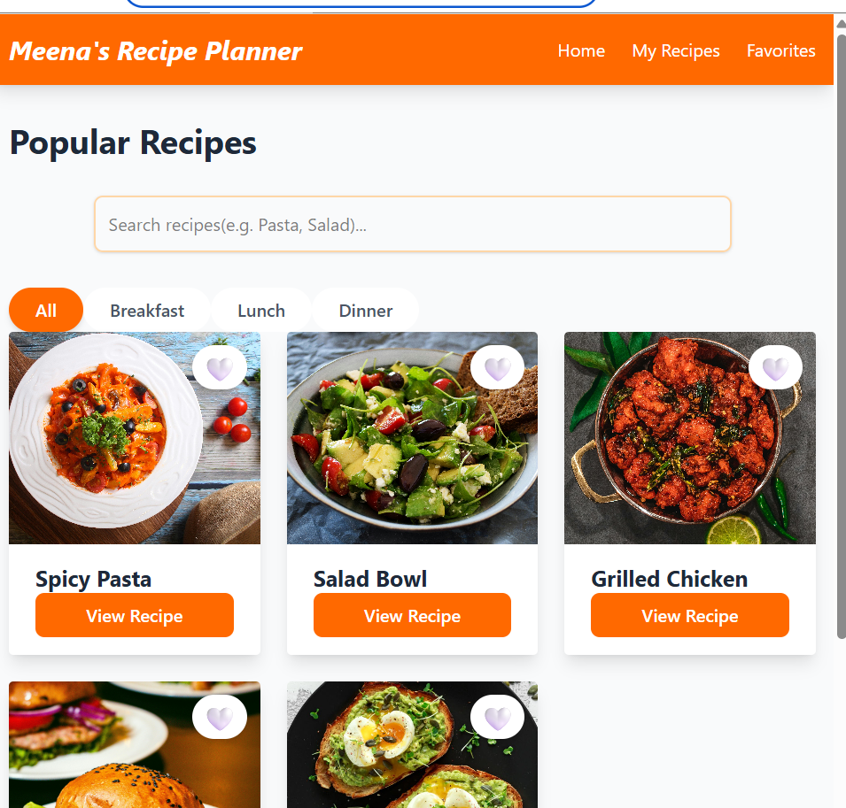
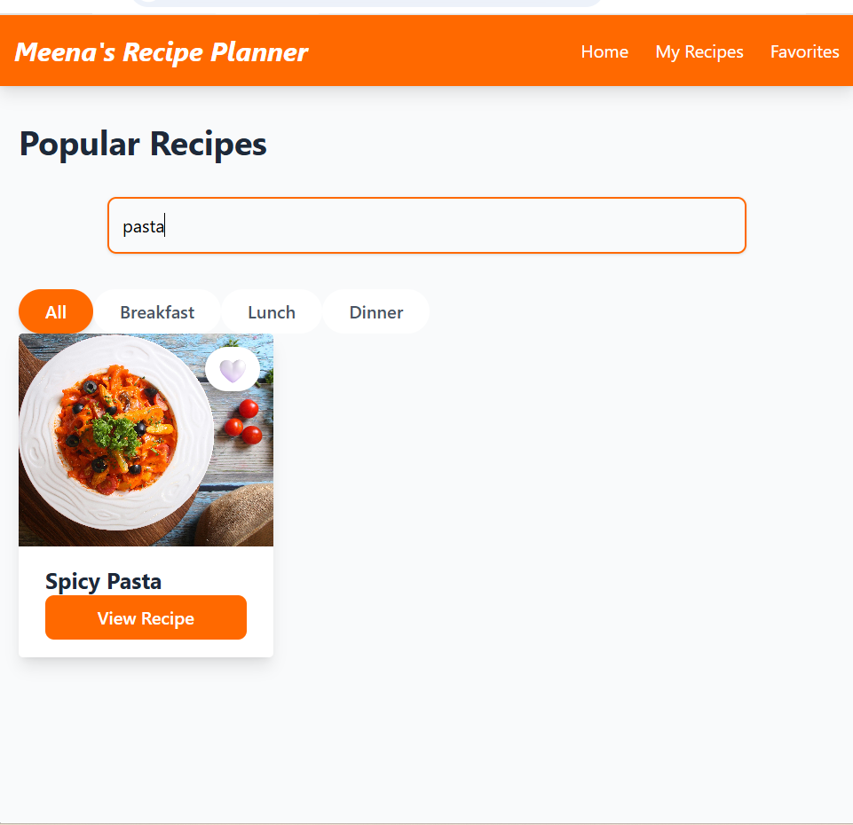
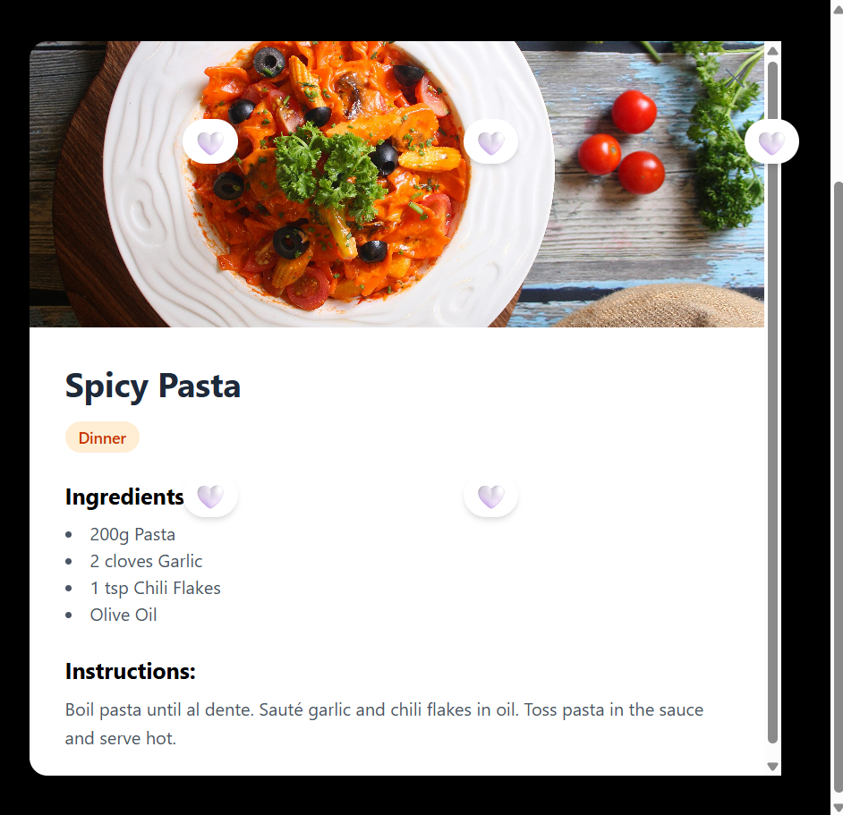

# 🍳 Meena's Recipe Planner

A professional, responsive **React + Vite** application built with **Tailwind CSS**. This project helps users discover, filter, and save their favorite recipes with persistent data.


## ✨ Features

- **🔍 Search Functionality**: Real-time filtering of recipes by title.
- **📂 Category Filtering**: Sort recipes by Breakfast, Lunch, or Dinner.
- **❤️ Favorites System**: Toggle favorites on any recipe with a live counter in the Navbar.
- **💾 Local Storage**: Your favorite recipes are saved even after refreshing the page.
- **📱 Responsive Design**: Fully optimized for Mobile, Tablet, and Desktop using Tailwind CSS.
- **📋 Recipe Details**: Interactive Modal popup showing ingredients and instructions.

## 🛠️ Tech Stack

- **Framework**: React (Vite)
- **Styling**: Tailwind CSS
- **Icons**: Emoji-based UI
- **State Management**: React Hooks (`useState`, `useEffect`)
- **Version Control**: Professional Git Flow (Feature Branch Workflow)

## 🚀 Getting Started

Follow these steps to run the project locally:

1. **Clone the repository:**
   ```bash
   git clone https://github.com


# 🍳 Meena's Recipe Planner

[🔗 View Live Demo](https://meena-s-recipe-planner-ijzgqxiha-meena-purohits-projects.vercel.app/)

## 📸 Screenshots


| Home Page | Search Results | Recipe Details |
| :--- | :--- | :--- |
|  |  |  |
